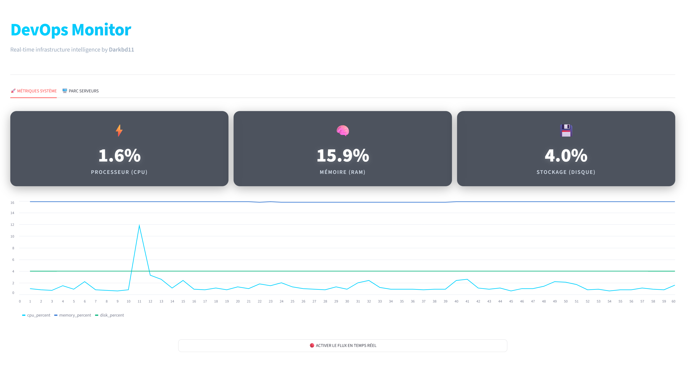

# 🚀 DevOps Monitoring Dashboard

Un système de monitoring système en temps réel, conçu par **Boulaye (darkbd11)**. Ce projet permet de surveiller facilement les ressources (CPU, RAM, Disque) et l'état de serveurs à distance grâce à une API performante et un dashboard interactif.



## 🏗️ Architecture

Le projet est divisé en deux composants principaux, conteneurisés via Docker :

1. **API (Backend)** : Construite avec FastAPI et `psutil`, elle expose les métriques du système via HTTP et WebSocket.
2. **Dashboard (Frontend)** : Construit avec Streamlit, il récupère les données de l'API pour les afficher sous forme de graphiques et de tableaux en temps réel.

## 🛠️ Prérequis

- **Docker Desktop** (ou Docker et Docker Compose)
- **Make** (optionnel, mais pratique pour les commandes raccourcies)

## 🚀 Démarrage Rapide (En moins de 5 minutes)

1. **Cloner le projet**
   ```bash
   git clone <ton-url-de-repo>
   cd devops-monitor
   ```

2. **Configurer l'environnement**
   Copie le fichier d'exemple pour créer ton fichier `.env` :
   ```bash
   cp .env.example .env
   ```
   *Note : Ouvre le fichier `.env` et définis ta propre `API_KEY` secrète.*

3. **Lancer avec Docker Desktop**
   Utilise la commande `make` ou directement Docker Compose :
   ```bash
   make up
   # ou : docker compose up --build -d
   ```

4. **Accéder à l'application**
   - **Dashboard** : [http://localhost:8501](http://localhost:8501)
   - **Documentation API** : [http://localhost:8000/docs](http://localhost:8000/docs)

## 🧪 Tests et Intégration Continue (CI/CD)

Le projet intègre un pipeline CI/CD GitHub Actions robuste :
- **Tests** : À chaque push, `pytest` s'assure que le code fonctionne avec une couverture de code de plus de 75%.
- **Déploiement (GHCR)** : Sur la branche `main` (ou via un déclenchement manuel "Run workflow"), les images Docker (`api-devops` et `dashboard-devops`) sont automatiquement construites et publiées sur le GitHub Container Registry (GHCR).

> [!IMPORTANT]
> **Permissions GHCR** : Pour que la publication réussisse, assurez-vous que les permissions "Read and write permissions" sont activées dans les paramètres de votre repository GitHub (`Settings` -> `Actions` -> `General` -> `Workflow permissions`).

Pour lancer les tests localement :
```bash
make test
# ou : pytest tests/ -v --cov=api --cov-fail-under=75
```

## ⚙️ Variables d'Environnement

- `API_KEY` : Le mot de passe (token) requis pour interagir avec les endpoints sécurisés de l'API (ex: ajouter un serveur).
- `API_BASE_URL` : L'adresse de l'API telle qu'elle est vue par le Dashboard (par défaut `http://api:8000` au sein du réseau Docker).

## 📝 Commandes Utiles (Makefile)

| Commande | Action |
|----------|--------|
| `make up` | Construit et démarre tous les conteneurs en tâche de fond. |
| `make down` | Arrête et supprime les conteneurs. |
| `make logs` | Affiche les logs en temps réel. |
| `make test` | Lance les tests unitaires. |

---
**Développé avec ❤️ par darkbd11**
